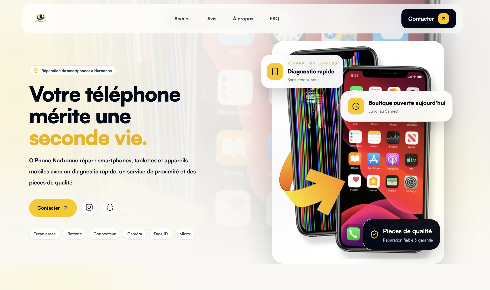
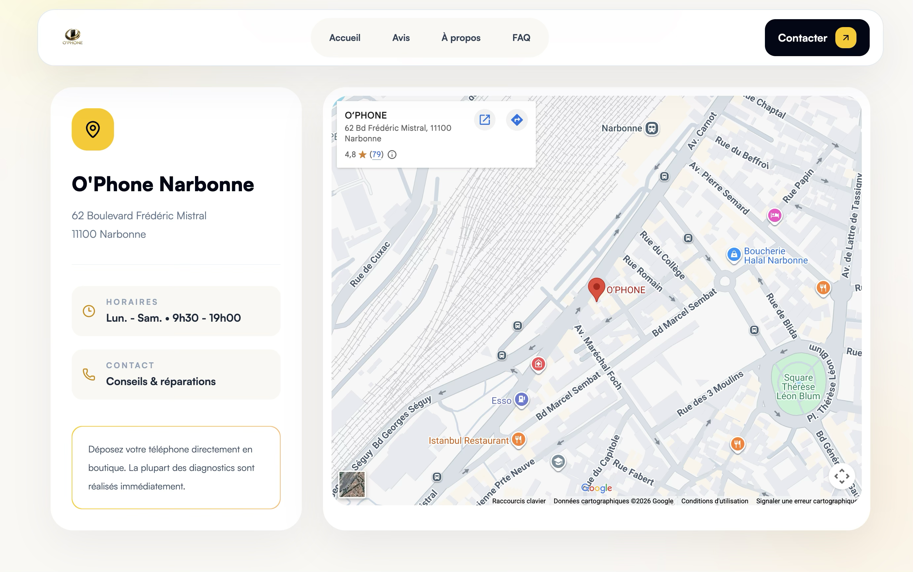
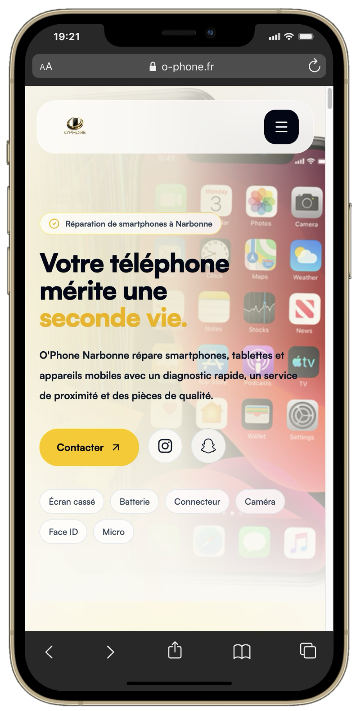
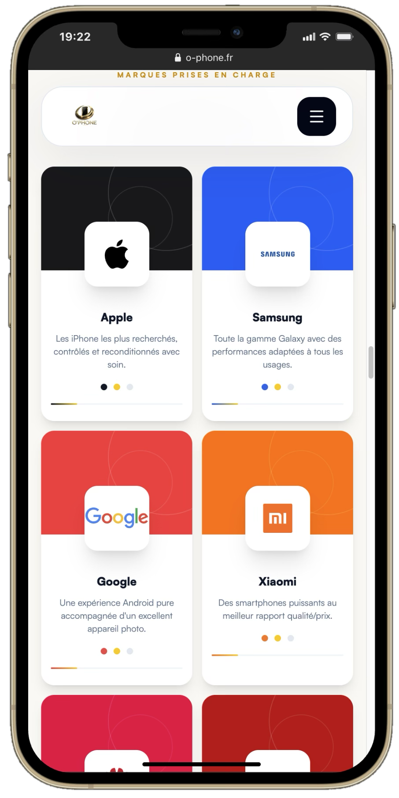

# O'Phone

### Description
Site vitrine développé pour O’PHONE, spécialiste de la réparation de smartphones et tablettes à Narbonne. Le projet présente les différents services de réparation, les appareils pris en charge et les informations pratiques de la boutique, avec une interface pensée pour faciliter la prise de contact. 

**[Visiter le site](https://o-phone.fr/)**

### Aperçu web

  
  

### Fonctionnalités

- Présentation des services de réparation
- Informations pratiques sur la boutique
- Contact et demande de renseignements
- Expérience optimisée pour mobile et desktop

### Technologies

`React` · `Vite` · `Tailwind CSS` · `Lenis` · `Framer Motion`

### Aperçu mobile

  
  
  

